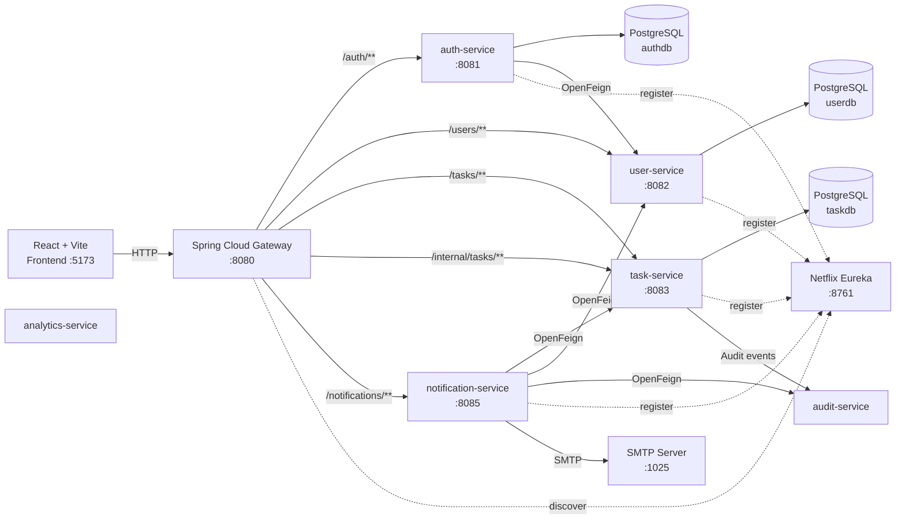
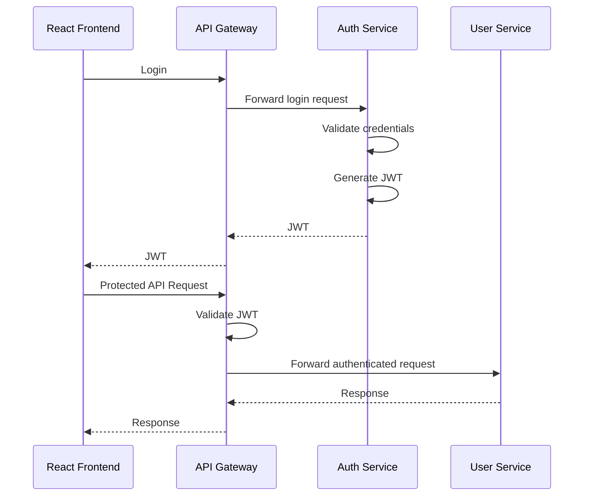

# Task Management System

A full-stack **Task Management System** built with a **Java 17 microservices backend** and a **React + Vite frontend**.

The backend follows a microservices architecture using **Spring Boot, Spring Cloud Gateway, Netflix Eureka, OpenFeign, Spring Security, JWT, PostgreSQL, and Flyway**. The frontend is built with **React 18 and Vite**.

---

## Table of Contents

- [Overview](#overview)
- [Architecture](#architecture)
- [Technology Stack](#technology-stack)
- [Project Structure](#project-structure)
- [Microservices](#microservices)
- [Service Ports](#service-ports)
- [Request Flow](#request-flow)
- [Authentication](#authentication)
- [Service-to-Service Communication](#service-to-service-communication)
- [Database](#database)
- [Environment Configuration](#environment-configuration)
- [Prerequisites](#prerequisites)
- [Run the Application](#run-the-application)
- [API Examples](#api-examples)
- [Database Migrations](#database-migrations)
- [Monitoring](#monitoring)
- [Security](#security)
- [Git](#git)
- [Docker](#docker)
- [Future Enhancements](#future-enhancements)

---

## Overview

The application is designed as a distributed task-management platform where users can authenticate, manage tasks, and receive notifications.

The backend is organized as independent Maven modules/services. **Eureka** provides service discovery, **Spring Cloud Gateway** acts as the single external entry point, and **OpenFeign** is used for internal service communication.

### Core capabilities

- User registration and login
- JWT-based authentication
- Password hashing using BCrypt
- User management
- Task creation and management
- Task status and due-date management
- Notification processing
- Email delivery through SMTP
- Internal service authentication
- Audit-event recording
- Analytics service
- PostgreSQL persistence
- Flyway database migrations
- Eureka-based service discovery
- API Gateway routing

---

# Architecture



> `audit-service` and `analytics-service` are included in the Maven backend reactor. Their ports are not specified in the current project documentation, so no port is assumed here.

---

# Technology Stack

## Backend

| Technology | Version / Details |
|---|---|
| Java | 17 |
| Spring Boot | 3.3.4 |
| Spring Cloud | 2023.0.3 |
| Build Tool | Maven |
| Architecture | Microservices |
| API Gateway | Spring Cloud Gateway |
| Service Discovery | Netflix Eureka |
| Service Communication | OpenFeign + Eureka |
| Security | Spring Security + JWT |
| Password Hashing | BCrypt |
| Database | PostgreSQL |
| Database Migration | Flyway |

## Frontend

| Technology | Version |
|---|---|
| React | 18.3.1 |
| React DOM | 18.3.1 |
| Vite | 5.4.8 |
| Axios | 1.7.7 |
| Bootstrap | 5.3.3 |
| React Router | 6.26.2 |
| ESLint | 10.x |

---

# Project Structure

```text
C:\TMS
│
├── backend
│   ├── pom.xml
│   │
│   ├── common-lib
│   ├── discovery-service
│   ├── api-gateway
│   ├── auth-service
│   ├── user-service
│   ├── task-service
│   ├── notification-service
│   ├── audit-service
│   └── analytics-service
│
├── frontend
│   ├── package.json
│   ├── src
│   └── ...
│
├── .vscode
├── .gitignore
└── README.md
```

---

# Microservices

## 1. common-lib

Shared backend library containing reusable components used by multiple services.

---

## 2. discovery-service

Netflix Eureka server responsible for service discovery.

### Responsibilities

- Maintains the service registry
- Allows backend services to register themselves
- Allows the API Gateway to discover service instances
- Does not register itself with Eureka
- Does not fetch a registry from another Eureka server

**Port:** `8761`

---

## 3. api-gateway

Spring Cloud Gateway is the primary entry point for frontend API requests.

**Port:** `8080`

### Configured routes

| Path | Service |
|---|---|
| `/auth/**` | auth-service |
| `/users/**` | user-service |
| `/tasks/**` | task-service |
| `/internal/tasks/**` | task-service |
| `/notifications/**` | notification-service |

The gateway uses Eureka service discovery with load-balanced service URLs:

```text
lb://auth-service
lb://user-service
lb://task-service
lb://notification-service
```

Gateway discovery locator is explicitly disabled; routes are configured manually.

---

## 4. auth-service

Responsible for authentication and account management.

**Port:** `8081`

### Responsibilities

- User registration
- User login
- JWT generation
- Password hashing
- Authentication
- Admin initialization
- Internal service authentication
- PostgreSQL persistence
- Flyway database migrations

**Database:** `authdb`

---

## 5. user-service

Responsible for user-related functionality.

**Port:** `8082`

### Responsibilities

- User management
- User-related API operations
- PostgreSQL persistence
- Flyway database migrations
- Internal service authentication
- Eureka service registration

**Database:** `userdb`

---

## 6. task-service

Responsible for task management.

**Port:** `8083`

### Responsibilities

- Create tasks
- Retrieve tasks
- Update tasks
- Manage task status
- Manage task descriptions
- Manage due dates
- User-specific task operations
- PostgreSQL persistence
- Flyway database migrations
- Internal service authentication

**Database:** `taskdb`

---

## 7. notification-service

Responsible for application notifications and email functionality.

**Port:** `8085`

### Responsibilities

- Notification processing
- Task-related notifications
- Communication with task-service
- Communication with user-service
- SMTP email delivery
- Internal service authentication

Email notifications are enabled by default in the current configuration.

---

## 8. audit-service

Responsible for recording application audit events generated by backend services.

The service is used by internal services through OpenFeign for audit-event recording.

---

## 9. analytics-service

Responsible for analytics-related functionality and reporting.

The service is included in the Maven multi-module backend.

---

# Service Ports

| Component | Port |
|---|---:|
| React / Vite | `5173` |
| API Gateway | `8080` |
| auth-service | `8081` |
| user-service | `8082` |
| task-service | `8083` |
| notification-service | `8085` |
| Eureka | `8761` |
| PostgreSQL | `5432` |
| SMTP | `1025` |
| audit-service | Not specified |
| analytics-service | Not specified |

---

# Request Flow

A typical frontend request follows this path:

```text
React Frontend
      |
      v
API Gateway :8080
      |
      +----> auth-service :8081
      |
      +----> user-service :8082
      |
      +----> task-service :8083
      |
      +----> notification-service :8085
```

Service discovery is handled by Eureka:

```text
Backend Services
       |
       v
Netflix Eureka :8761
       ^
       |
API Gateway
```

---

# Authentication

The application uses JWT-based authentication.

### Login flow



### Development admin

The current development configuration provides:

```text
Username: admin
Password: admin
```

These values can be changed using:

```text
ADMIN_USERNAME
ADMIN_PASSWORD
```

Do not use development credentials in production.

---

# Service-to-Service Communication

Internal communication uses **OpenFeign + Eureka**.

Current documented communication includes:

```text
auth-service
      |
      +----> user-service

notification-service
      |
      +----> task-service
      |
      +----> user-service
```

Internal requests are protected using:

```text
INTERNAL_TOKEN
```

The same internal token must be configured consistently across services that communicate internally.

---

# Database

PostgreSQL is used for persistent application data.

### PostgreSQL

```text
Host: localhost
Port: 5432
```

### Databases

```text
authdb
userdb
taskdb
```

### JDBC URLs

```text
jdbc:postgresql://localhost:5432/authdb
jdbc:postgresql://localhost:5432/userdb
jdbc:postgresql://localhost:5432/taskdb
```

Hibernate uses:

```text
ddl-auto=validate
```

Flyway is responsible for database migrations.

---

# Environment Configuration

## Gateway

```text
EUREKA_URL
JWT_SECRET
JWT_EXPIRATION_SECONDS
```

Development values:

```text
EUREKA_URL=http://localhost:8761/eureka/
JWT_EXPIRATION_SECONDS=86400
```

## Auth Service

```text
EUREKA_URL
AUTH_DB_URL
AUTH_DB_USER
AUTH_DB_PASSWORD
JWT_SECRET
JWT_EXPIRATION_SECONDS
INTERNAL_TOKEN
ADMIN_USERNAME
ADMIN_PASSWORD
```

## User Service

```text
EUREKA_URL
USER_DB_URL
USER_DB_USER
USER_DB_PASSWORD
INTERNAL_TOKEN
```

## Task Service

```text
EUREKA_URL
TASK_DB_URL
TASK_DB_USER
TASK_DB_PASSWORD
INTERNAL_TOKEN
```

## Notification Service

```text
EUREKA_URL
SMTP_HOST
SMTP_PORT
SMTP_USERNAME
SMTP_PASSWORD
INTERNAL_TOKEN
NOTIFICATIONS_EMAIL_ENABLED
NOTIFICATIONS_EMAIL_FROM
```

### Local SMTP configuration

```text
SMTP_HOST=localhost
SMTP_PORT=1025
NOTIFICATIONS_EMAIL_ENABLED=true
NOTIFICATIONS_EMAIL_FROM=no-reply@taskapp.local
```

---

# Prerequisites

Install the following:

- JDK 17
- Maven
- Node.js
- npm
- PostgreSQL
- Git

Verify the installations:

```powershell
java -version
mvn -version
node -v
npm -v
```

PostgreSQL should be available on port `5432`.

---

# PostgreSQL Setup

Create the application databases:

```sql
CREATE DATABASE authdb;
CREATE DATABASE userdb;
CREATE DATABASE taskdb;
```

The documented development configuration expects:

```text
Host: localhost
Port: 5432
Username: postgres
Password: root
```

If your local PostgreSQL credentials are different, configure the corresponding environment variables.

Flyway runs database migrations when the applicable services start.

---

# Build the Backend

From the project root:

```powershell
cd C:\TMS
```

Build all backend modules:

```powershell
mvn -f backend\pom.xml clean package -DskipTests
```

To execute the test suite as part of the build:

```powershell
mvn -f backend\pom.xml clean package
```

### Maven reactor

```text
task-management-backend
├── common-lib
├── discovery-service
├── api-gateway
├── auth-service
├── user-service
├── task-service
├── notification-service
├── audit-service
└── analytics-service
```

---

# Run the Application

Start the services in separate PowerShell terminals.

## 1. Discovery Service

```powershell
cd C:\TMS
java -jar .\backend\discovery-service\target\<discovery-service-jar>.jar
```

Port: `8761`

## 2. API Gateway

```powershell
cd C:\TMS
java -jar .\backend\api-gateway\target\<api-gateway-jar>.jar
```

Port: `8080`

## 3. Auth Service

```powershell
cd C:\TMS
java -jar .\backend\auth-service\target\<auth-service-jar>.jar
```

Port: `8081`

## 4. User Service

```powershell
cd C:\TMS
java -jar .\backend\user-service\target\<user-service-jar>.jar
```

Port: `8082`

## 5. Task Service

```powershell
cd C:\TMS
java -jar .\backend\task-service\target\<task-service-jar>.jar
```

Port: `8083`

## 6. Notification Service

```powershell
cd C:\TMS
java -jar .\backend\notification-service\target\<notification-service-jar>.jar
```

Port: `8085`

> Start Eureka first so that the other services can register with the service registry.

---

# Run the Frontend

Open a new PowerShell terminal:

```powershell
cd C:\TMS\frontend
```

Install dependencies:

```powershell
npm install
```

Start the development server:

```powershell
npm run dev
```

The Vite development server runs on:

```text
http://localhost:5173
```

---

# Frontend Commands

### Development

```powershell
npm run dev
```

### Production build

```powershell
npm run build
```

### Lint

```powershell
npm run lint
```

### Preview production build

```powershell
npm run preview
```

---

# API Examples

All external frontend requests are routed through the API Gateway.

## Register

```http
POST /auth/register
```

Example:

```json
{
  "username": "alice",
  "password": "secret123"
}
```

## Login

```http
POST /auth/login
```

Example:

```json
{
  "username": "alice",
  "password": "secret123"
}
```

The login response returns a JWT token:

```json
{
  "token": "eyJ..."
}
```

## Create Task

```http
POST /tasks
```

Authorization:

```text
Authorization: Bearer <JWT_TOKEN>
```

Example:

```json
{
  "title": "Write project report",
  "description": "Prepare the project report",
  "dueDate": "2026-12-15",
  "status": "PENDING"
}
```

---

# Service Discovery

Eureka runs on:

```text
http://localhost:8761
```

The Eureka registration URL is:

```text
http://localhost:8761/eureka/
```

The documented services registering with Eureka are:

```text
auth-service
user-service
task-service
notification-service
```

The API Gateway uses Eureka to discover these services.

---

# Notifications and SMTP

The notification-service uses Spring Mail.

Default local configuration:

```text
SMTP_HOST=localhost
SMTP_PORT=1025
```

Email notifications:

```text
NOTIFICATIONS_EMAIL_ENABLED=true
```

Default sender:

```text
no-reply@taskapp.local
```

An SMTP server must be available at the configured host and port when email functionality is used.

MailHog is not currently included in the repository's Docker/infrastructure configuration.

---

# Database Migrations

Auth, user, and task services use Flyway.

Migration files are located at:

```text
src/main/resources/db/migration
```

Flyway configuration:

```yaml
spring:
  flyway:
    enabled: true
    locations: classpath:db/migration
```

Hibernate is configured with:

```text
ddl-auto: validate
```

This means Hibernate validates the database schema rather than automatically creating or modifying it.

---

# Monitoring

Management endpoints are enabled for monitoring and troubleshooting.

Depending on the service, available endpoints include:

```text
health
info
mappings
gateway
```

Use the health endpoint to verify whether a service is running correctly.

---

# Security

The application uses:

- Spring Security
- JWT authentication
- BCrypt password hashing
- Internal service authentication

### Security guidelines

- Never commit production credentials.
- Never commit production JWT secrets.
- Never commit database passwords.
- Keep `INTERNAL_TOKEN` secret.
- Use environment variables for sensitive configuration.
- Do not expose internal backend services directly to untrusted networks.
- Route external API requests through the API Gateway.
- Use HTTPS in production.
- Replace development credentials before deployment.

---

# Git

The project is maintained using Git.

Useful commands:

```powershell
cd C:\TMS

git status
git branch
git add .
git commit -m "Update task management system"
git push
```

Before committing, verify that sensitive and generated files are ignored.

Do not commit:

```text
.env
*.env
application-local.yml
application-prod.yml
target/
node_modules/
```

Also verify that the following are not exposed:

```text
Database passwords
JWT secrets
Internal service tokens
Production credentials
API keys
Private certificates
```

---

# Docker

Docker / Docker Compose is **not currently configured** in the project.

There is currently no:

```text
docker-compose.yml
```

in the project root.

Docker can be introduced later for:

- PostgreSQL
- Eureka
- Backend services
- Frontend
- MailHog
- Redis
- Kafka / RabbitMQ

---

# Future Enhancements

Potential improvements include:

- Docker / Docker Compose
- Redis caching
- Kafka or RabbitMQ
- Centralized configuration
- Distributed tracing
- Swagger / OpenAPI documentation
- Unit and integration test improvements
- CI/CD pipeline
- Centralized logging
- Monitoring and metrics
- Role-based access control enhancements
- Task scheduling
- Notification scheduling
- Cloud deployment
- Production-ready secret management

---

## Project Summary

```text
Task Management System
│
├── Frontend
│   ├── React 18.3.1
│   ├── Vite 5.4.8
│   ├── Axios 1.7.7
│   ├── Bootstrap 5.3.3
│   └── React Router 6.26.2
│
├── Backend
│   ├── Java 17
│   ├── Spring Boot 3.3.4
│   ├── Spring Cloud 2023.0.3
│   ├── Spring Cloud Gateway
│   ├── Netflix Eureka
│   ├── OpenFeign
│   ├── Spring Security
│   ├── JWT
│   ├── BCrypt
│   ├── PostgreSQL
│   └── Flyway
│
└── Services
    ├── common-lib
    ├── discovery-service
    ├── api-gateway
    ├── auth-service
    ├── user-service
    ├── task-service
    ├── notification-service
    ├── audit-service
    └── analytics-service
```

---

**Task Management System — Java 17 + Spring Boot Microservices + React**
