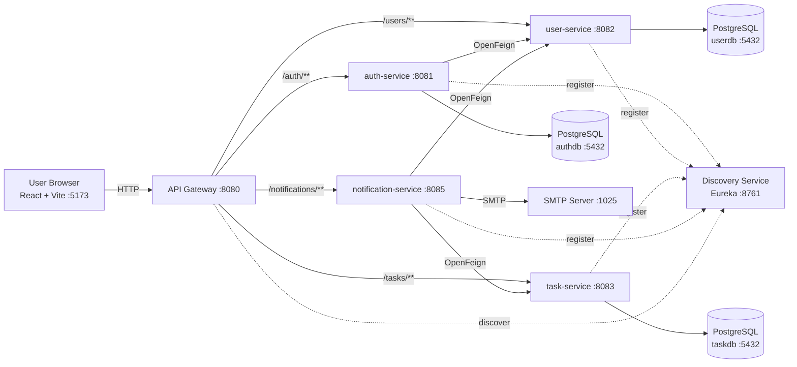
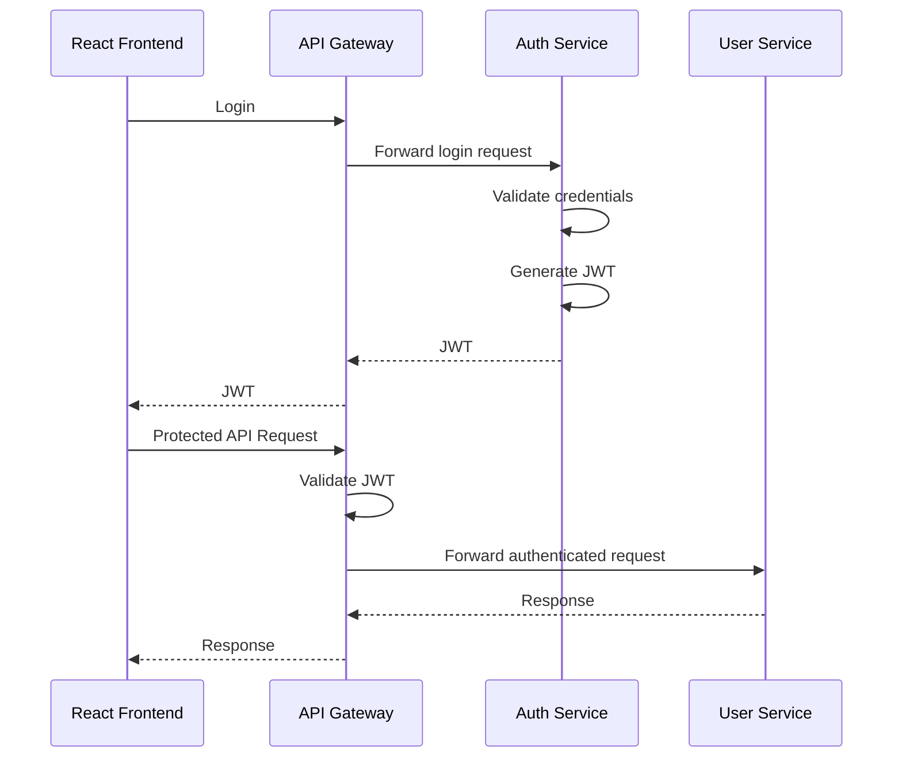

# Task Management System

A full-stack Task Management System built using a Java 17 microservices backend and a React frontend.

The backend is implemented as a Maven multi-module project using Spring Boot 3.3.4, Spring Cloud 2023.0.3, Spring Cloud Gateway, Netflix Eureka, OpenFeign, Spring Security, JWT, PostgreSQL, and Flyway.

The frontend is built with React 18.3.1 and Vite 5.4.8.

---

## Technology Stack

### Backend

| Technology            | Version / Details     |
| --------------------- | --------------------- |
| Java                  | 17                    |
| Spring Boot           | 3.3.4                 |
| Spring Cloud          | 2023.0.3              |
| Build Tool            | Maven                 |
| Architecture          | Microservices         |
| API Gateway           | Spring Cloud Gateway  |
| Service Discovery     | Netflix Eureka        |
| Service Communication | OpenFeign / Eureka    |
| Security              | Spring Security + JWT |
| Password Hashing      | BCrypt                |
| Database              | PostgreSQL            |
| Database Migration    | Flyway                |

### Frontend

| Technology   | Version |
| ------------ | ------- |
| React        | 18.3.1  |
| React DOM    | 18.3.1  |
| Vite         | 5.4.8   |
| Axios        | 1.7.7   |
| Bootstrap    | 5.3.3   |
| React Router | 6.26.2  |
| ESLint       | 10.x    |

---

# Project Structure

```text
C:\TMS
│
├── backend
│   ├── pom.xml
│   │
│   ├── common-lib
│   ├── discovery-service
│   ├── api-gateway
│   ├── auth-service
│   ├── user-service
│   ├── task-service
│   └── notification-service
│
├── frontend
│   ├── package.json
│   ├── src
│   └── ...
│
├── .vscode
├── .gitignore
└── README.md
```

---

# System Architecture



---

# Microservices

## 1. common-lib

Shared library used by backend services.

The module contains reusable components shared across multiple services.

---

## 2. discovery-service

Netflix Eureka server responsible for service discovery.

Responsibilities:

* Maintains the service registry.
* Allows backend services to register themselves.
* Allows the API Gateway to discover service instances.
* Does not register itself with Eureka.
* Does not fetch a registry from another Eureka server.

Port:

```text
8761
```

---

## 3. api-gateway

The API Gateway is the primary entry point for frontend requests.

Port:

```text
8080
```

Configured routes:

| Path                 | Service              |
| -------------------- | -------------------- |
| `/auth/**`           | auth-service         |
| `/users/**`          | user-service         |
| `/tasks/**`          | task-service         |
| `/internal/tasks/**` | task-service         |
| `/notifications/**`  | notification-service |

The gateway uses Eureka service discovery through load-balanced service URLs such as:

```text
lb://auth-service
lb://user-service
lb://task-service
lb://notification-service
```

Gateway discovery locator is explicitly disabled. Routes are configured manually.

---

## 4. auth-service

Responsible for authentication and account management.

Port:

```text
8081
```

Responsibilities include:

* User registration
* User login
* JWT generation
* Password hashing
* Authentication
* Admin initialization
* Internal service authentication
* PostgreSQL persistence
* Flyway database migrations

Database:

```text
authdb
```

---

## 5. user-service

Responsible for user-related functionality.

Port:

```text
8082
```

Responsibilities include:

* User management
* User-related API operations
* PostgreSQL persistence
* Flyway database migrations
* Internal service authentication
* Eureka service registration

Database:

```text
userdb
```

---

## 6. task-service

Responsible for task management.

Port:

```text
8083
```

Responsibilities include:

* Creating tasks
* Retrieving tasks
* Updating tasks
* Task status management
* Task descriptions
* Due dates
* User-specific task operations
* PostgreSQL persistence
* Flyway database migrations
* Internal service authentication

Database:

```text
taskdb
```

---

## 7. notification-service

Responsible for application notifications and email functionality.

Port:

```text
8085
```

Responsibilities include:

* Notification processing
* Task-related notifications
* Communication with task-service
* Communication with user-service
* SMTP email delivery
* Internal service authentication

Email notifications are enabled by default in the current configuration.

---

# Service Ports

| Component                  | Port |
| -------------------------- | ---: |
| React / Vite Frontend      | 5173 |
| API Gateway                | 8080 |
| auth-service               | 8081 |
| user-service               | 8082 |
| task-service               | 8083 |
| notification-service       | 8085 |
| discovery-service / Eureka | 8761 |
| PostgreSQL                 | 5432 |
| SMTP                       | 1025 |

---

# Database Configuration

The current local configuration uses PostgreSQL on:

```text
localhost:5432
```

Three databases are used:

```text
authdb
userdb
taskdb
```

Default development JDBC URLs:

```text
jdbc:postgresql://localhost:5432/authdb
jdbc:postgresql://localhost:5432/userdb
jdbc:postgresql://localhost:5432/taskdb
```

Database credentials are configured separately for each service.

### Auth Service

```text
AUTH_DB_URL
AUTH_DB_USER
AUTH_DB_PASSWORD
```

### User Service

```text
USER_DB_URL
USER_DB_USER
USER_DB_PASSWORD
```

### Task Service

```text
TASK_DB_URL
TASK_DB_USER
TASK_DB_PASSWORD
```

The services use:

```text
spring.jpa.hibernate.ddl-auto=validate
```

and Flyway migrations are enabled.

---

# Environment Variables

## Gateway

```text
EUREKA_URL
JWT_SECRET
JWT_EXPIRATION_SECONDS
```

Default development values:

```text
EUREKA_URL=http://localhost:8761/eureka/
JWT_EXPIRATION_SECONDS=86400
```

---

## Auth Service

```text
EUREKA_URL

AUTH_DB_URL
AUTH_DB_USER
AUTH_DB_PASSWORD

JWT_SECRET
JWT_EXPIRATION_SECONDS

INTERNAL_TOKEN

ADMIN_USERNAME
ADMIN_PASSWORD
```

Current development defaults include:

```text
AUTH_DB_URL=jdbc:postgresql://localhost:5432/authdb
AUTH_DB_USER=
AUTH_DB_PASSWORD=

ADMIN_USERNAME=
ADMIN_PASSWORD=
```

---

## User Service

```text
EUREKA_URL

USER_DB_URL
USER_DB_USER
USER_DB_PASSWORD

INTERNAL_TOKEN
```

Development database:

```text
USER_DB_URL=jdbc:postgresql://localhost:5432/userdb
USER_DB_USER=
USER_DB_PASSWORD=
```

---

## Task Service

```text
EUREKA_URL

TASK_DB_URL
TASK_DB_USER
TASK_DB_PASSWORD

INTERNAL_TOKEN
```

Development database:

```text
TASK_DB_URL=jdbc:postgresql://localhost:5432/taskdb
TASK_DB_USER=
TASK_DB_PASSWORD=
```

---

## Notification Service

```text
EUREKA_URL

SMTP_HOST
SMTP_PORT
SMTP_USERNAME
SMTP_PASSWORD

INTERNAL_TOKEN

NOTIFICATIONS_EMAIL_ENABLED
NOTIFICATIONS_EMAIL_FROM
```

Development SMTP configuration:

```text
SMTP_HOST=localhost
SMTP_PORT=1025
NOTIFICATIONS_EMAIL_ENABLED=true
NOTIFICATIONS_EMAIL_FROM=no-reply@taskapp.local
```

---

# Prerequisites

Install the following before running the application:

* JDK 17
* Maven
* Node.js
* npm
* PostgreSQL
* Git

Verify Java:

```powershell
java -version
```

Verify Maven:

```powershell
mvn -version
```

Verify Node.js:

```powershell
node -v
```

Verify npm:

```powershell
npm -v
```

Verify PostgreSQL is available on port `5432`.

---

# PostgreSQL Setup

Create the required databases if they do not already exist:

```sql
CREATE DATABASE authdb;
CREATE DATABASE userdb;
CREATE DATABASE taskdb;
```

The current development configuration expects:

```text
Host: localhost
Port: 5432
Username: postgres
Password: root
```

If your local PostgreSQL username/password is different, configure the corresponding environment variables.

Flyway runs database migrations when the services start.

---

# Build Backend

From the project root:

```powershell
cd C:\TMS
```

Build all backend modules:

```powershell
mvn -f backend\pom.xml clean package -DskipTests
```

To run the test suite as part of the build:

```powershell
mvn -f backend\pom.xml clean package
```

The Maven reactor contains:

```text
common-lib
discovery-service
api-gateway
auth-service
user-service
task-service
notification-service
```

---

# Start Backend Services

Start each service in a separate PowerShell terminal.

## 1. Discovery Service

```powershell
cd C:\TMS
java -jar .\backend\discovery-service\target\<discovery-service-jar>.jar
```

Port:

```text
8761
```

---

## 2. API Gateway

```powershell
cd C:\TMS
java -jar .\backend\api-gateway\target\<api-gateway-jar>.jar
```

Port:

```text
8080
```

---

## 3. Auth Service

```powershell
cd C:\TMS
java -jar .\backend\auth-service\target\<auth-service-jar>.jar
```

Port:

```text
8081
```

---

## 4. User Service

```powershell
cd C:\TMS
java -jar .\backend\user-service\target\<user-service-jar>.jar
```

Port:

```text
8082
```

---

## 5. Task Service

```powershell
cd C:\TMS
java -jar .\backend\task-service\target\<task-service-jar>.jar
```

Port:

```text
8083
```

---

## 6. Notification Service

```powershell
cd C:\TMS
java -jar .\backend\notification-service\target\<notification-service-jar>.jar
```

Port:

```text
8085
```

Start the Discovery Service first so that the other services can register with Eureka.

---

# Start Frontend

Open a new PowerShell terminal:

```powershell
cd C:\TMS\frontend
```

Install dependencies:

```powershell
npm install
```

Start the development server:

```powershell
npm run dev
```

The Vite development server runs on:

```text
5173
```

---

# Frontend Commands

### Development

```powershell
npm run dev
```

### Production Build

```powershell
npm run build
```

### Lint

```powershell
npm run lint
```

### Preview Production Build

```powershell
npm run preview
```

---

# Authentication

The application uses JWT-based authentication.

Typical flow:



---

# Default Admin

The current auth-service configuration provides these development defaults:

```text
Username: admin
Password: admin
```

These values can be changed through:

```text
ADMIN_USERNAME
ADMIN_PASSWORD
```

For example, in PowerShell:

```powershell
$env:ADMIN_USERNAME="admin"
$env:ADMIN_PASSWORD="your-secure-password"
```

Do not use the development password in production.

---

# API Examples

The frontend communicates with the backend through the API Gateway.

## Register

Endpoint:

```text
POST /auth/register
```

Example request:

```json
{
  "username": "alice",
  "password": "secret123"
}
```

---

## Login

Endpoint:

```text
POST /auth/login
```

Example request:

```json
{
  "username": "alice",
  "password": "secret123"
}
```

The login response returns a JWT token.

Example:

```json
{
  "token": "eyJ..."
}
```

---

## Create Task

Endpoint:

```text
POST /tasks
```

Required authorization:

```text
Authorization: Bearer <JWT_TOKEN>
```

Example request:

```json
{
  "title": "Write project report",
  "description": "Prepare the project report",
  "dueDate": "2026-12-15",
  "status": "PENDING"
}
```

---

# Service Discovery

Eureka runs on:

```text
8761
```

The Eureka URL used by the services is:

```text
http://localhost:8761/eureka/
```

The following services register with Eureka:

```text
auth-service
user-service
task-service
notification-service
```

The API Gateway uses Eureka to discover these services.

---

# Internal Service Communication

The application uses service-to-service communication through OpenFeign and Eureka service discovery.

Examples include:

```text
auth-service -> user-service
notification-service -> task-service
notification-service -> user-service
```

Internal communication is protected using the configured internal token:

```text
INTERNAL_TOKEN
```

The same token must be configured consistently across services that communicate internally.

---

# Notifications and SMTP

The notification-service uses Spring Mail.

Default configuration:

```text
SMTP_HOST=localhost
SMTP_PORT=1025
```

Email notifications are currently enabled by default:

```text
NOTIFICATIONS_EMAIL_ENABLED=true
```

The sender address defaults to:

```text
no-reply@taskapp.local
```

An SMTP server must be available at the configured host and port when email functionality is used.

MailHog is **not currently included in this repository's Docker/infrastructure configuration**. It can be added separately for local email testing.

---

# Actuator / Management Endpoints

Management endpoints are enabled for monitoring and troubleshooting.

Depending on the service, endpoints include:

```text
health
info
mappings
gateway
```

The API Gateway additionally exposes gateway-related management information.

Use the health endpoint to verify whether a service is running correctly.

---

# Database Migrations

Auth, user, and task services use Flyway.

Migration files are located under:

```text
src/main/resources/db/migration
```

Flyway is enabled through:

```yaml
spring:
  flyway:
    enabled: true
    locations: classpath:db/migration
```

Hibernate is configured with:

```text
ddl-auto: validate
```

This means Hibernate validates the database schema rather than automatically creating or modifying it.

---

# Security

The application uses JWT authentication and BCrypt password hashing.

Security guidelines:

* Never commit production credentials.
* Never commit production JWT secrets.
* Never commit database passwords.
* Keep `INTERNAL_TOKEN` secret.
* Use environment variables for sensitive configuration.
* Do not expose internal backend services directly to untrusted networks.
* Route external API requests through the API Gateway.
* Use HTTPS in production.
* Replace development credentials before deployment.

The development configuration contains default credentials for local setup only. These should be replaced before the project is pushed to a public repository or deployed.

---

# Git Setup

The project currently contains a `.gitignore` file but Git has not yet been initialized at the `C:\TMS` project root.

Initialize Git from the project root:

```powershell
cd C:\TMS
git init
```

Check repository status:

```powershell
git status
```

Review which files will be committed before adding them:

```powershell
git status
```

Add project files:

```powershell
git add .
```

Review staged files:

```powershell
git status
```

Create the initial commit:

```powershell
git commit -m "Initial commit"
```

---

# Important Git Security Check

Before running:

```powershell
git add .
```

make sure the following are not accidentally committed:

```text
.env
*.env
application-local.yml
application-prod.yml
```

Also verify that generated files and dependencies are ignored:

```text
target/
node_modules/
```

Do not commit:

* Database passwords
* JWT secrets
* Internal service tokens
* Production credentials
* API keys
* Private certificates

---

# Docker Status

Docker / Docker Compose is **not currently configured in this project**.

There is currently no:

```text
docker-compose.yml
```

in the project root.

Therefore, Docker commands such as:

```text
docker compose up -d
```

are not part of the current setup.

Docker can be added later to containerize:

* PostgreSQL
* Eureka
* Backend services
* Frontend
* MailHog
* Redis
* Kafka/RabbitMQ

---

# Current Project Configuration

```text
Project
└── Task Management System

Backend
├── Java 17
├── Spring Boot 3.3.4
├── Spring Cloud 2023.0.3
├── Maven Multi-Module
├── Spring Cloud Gateway
├── Netflix Eureka
├── OpenFeign
├── Spring Security
├── JWT
├── BCrypt
├── PostgreSQL
└── Flyway

Backend Services
├── common-lib
├── discovery-service      : 8761
├── api-gateway            : 8080
├── auth-service           : 8081
├── user-service           : 8082
├── task-service           : 8083
└── notification-service   : 8085

Frontend
├── React                   : 18.3.1
├── React DOM               : 18.3.1
├── Vite                    : 5.4.8
├── Axios                   : 1.7.7
├── Bootstrap               : 5.3.3
└── React Router            : 6.26.2

Database
├── PostgreSQL              : 5432
├── authdb
├── userdb
└── taskdb

SMTP
└── localhost:1025

Git
└── Repository initialization pending
```

---

# Future Enhancements

Potential future improvements:

* Docker / Docker Compose
* Redis caching
* Kafka or RabbitMQ
* Centralized configuration
* Distributed tracing
* Swagger / OpenAPI documentation
* Unit and integration test improvements
* CI/CD pipeline
* Centralized logging
* Monitoring and metrics
* Role-based access control enhancements
* Task scheduling
* Notification scheduling
* Cloud deployment
* Production-ready secret management
